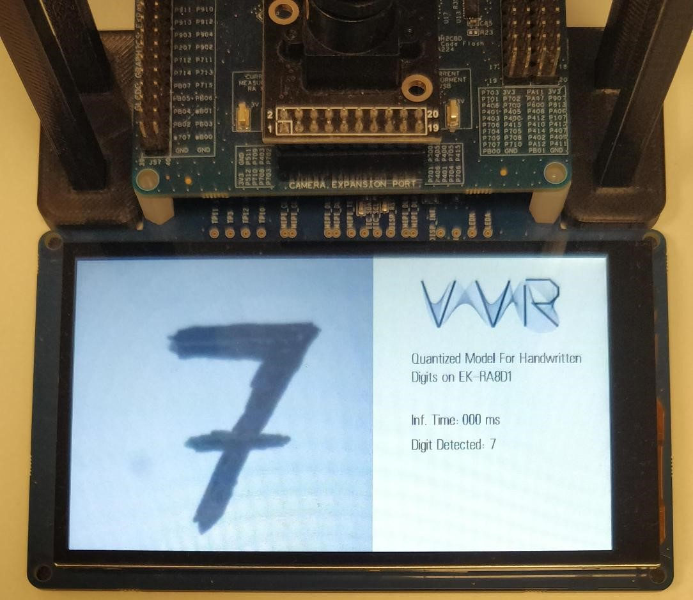
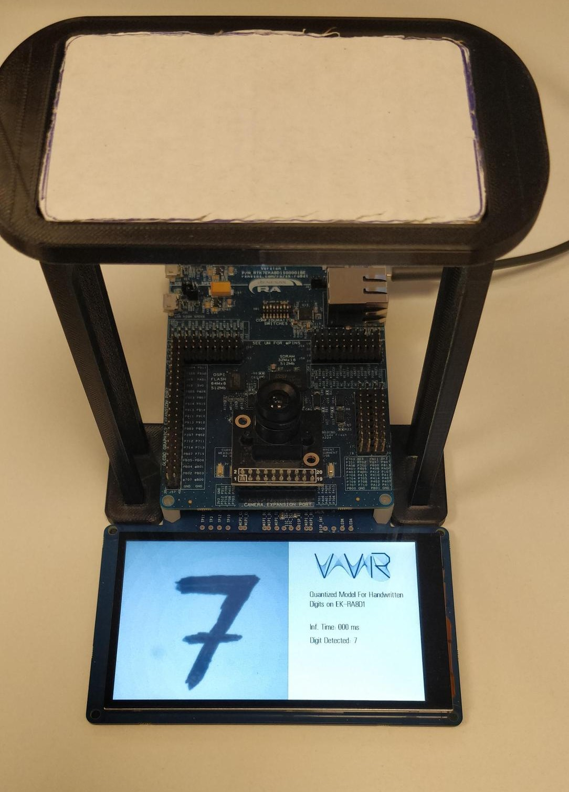
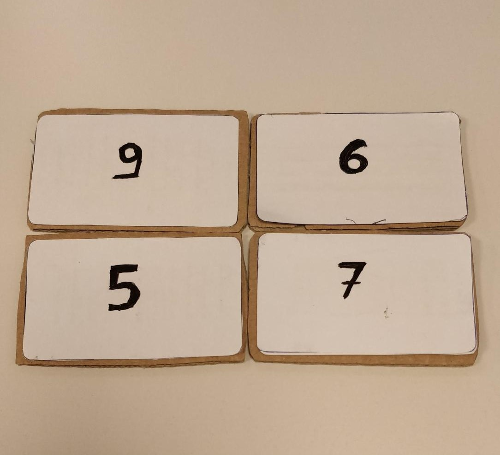
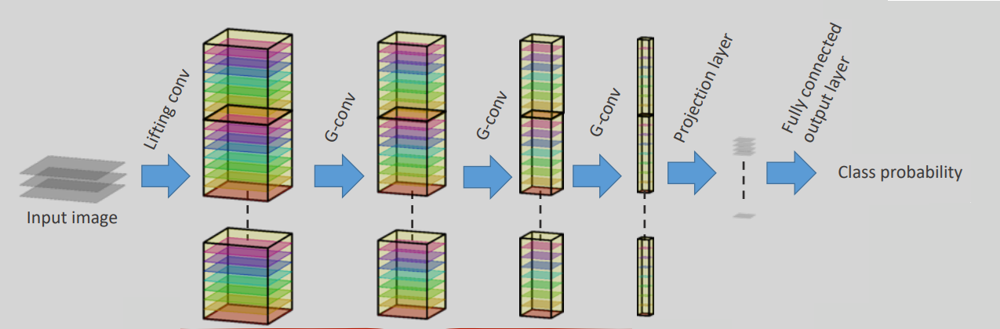

# EMBEDDED GEOMETRIC DEEP LEARNING METHODS

This repository contains the work conducted for the thesis titled **"Method of Integrated Geometric Deep Learning"**. It provides all the necessary files for the development of a fully functional system built around the EK-RA8D1 evaluation kit for digit recognition, as well as a base project for creating a Group Convolutional Neural Network using Python notebooks.

## Repository Contents:

### 1. **Group Convolution Part**
- **`regular_group_convolutions_gr.ipynb`**: A Python notebook implementing a  $C_4$-equivariant model for digit recognition.

### 2. **Digit Recognition on EK-RA8D1 Part**
- **`diploma_quant`**: Folder containing the application files for the e² studio.  
- **`Quant_training_example.ipynb`**: A Python notebook for training and creating quantized and non-quantized models.  
- **`DataSet.zip`**: The dataset used for training the models.  
- **`float_file_1.tflite`** & **`quant_file_1.tflite`**: Pretrained models generated from the notebook.  
- **`tflite2bin.py`**: Script to convert TensorFlow Lite models into header files for integration with the EK-RA8D1 project.  
- **`mnist_quant.tflite.cc`**: Header file generated for model integration.  
- **`data_collect.py`**: Script to convert hex data from e² studio into real images.  

---
## Digit Recognition on EK-RA8D1

## $C_4$ Equivariant Group Convolution NN For Digit Recognition

