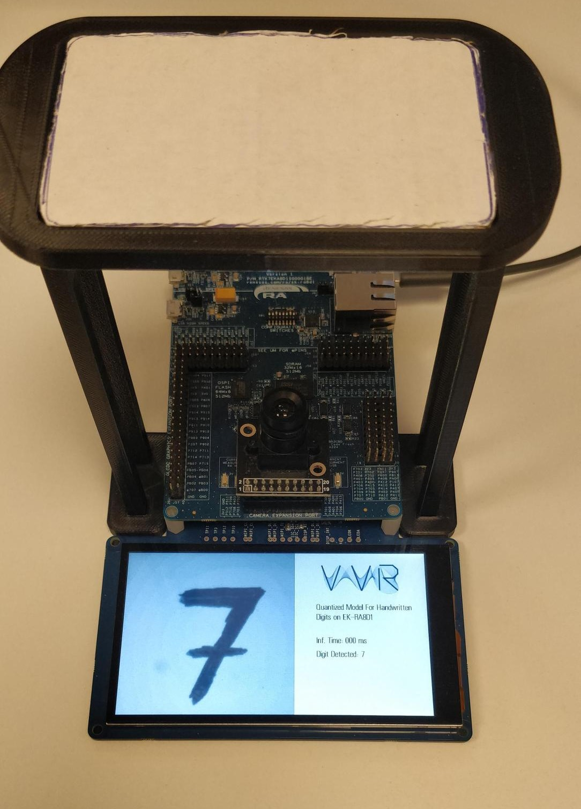

# About

→ This is a solution for digit recognition for the thesis
"METHOD OF INTEGRATED GEOMETRIC DEEP LEARNING"  on the EK-RA8D1.

Camera Input:320* 240 *2 YcbCr 422

NN Input :  28 *28 *1 

---

At Lcd you will view: The camera input in grayscale , and the results of inference

## Required Resources ##
To build and run the **diploma_quant** example project, the following resources are needed.

 

### Hardware ###
* Renesas RA™ MCU kit - 1x
* Micro USB cable - 1x
* HOST Machine - 1x
* LCD - 1x

Configuration Switches:

| SW1-1 PMOD1 | SW1-2 TRACE | SW1-3 CAMERA | SW1-4 ETHA | SW1-5 ETHB | SW1-6 GLCD | SW1-7 SDRAM | SW1-8 I3C |
|-------------|-------------|--------------|------------|------------|------------|-------------|-----------|
| OFF | ON | ON | OFF | OFF | ON | ON | OFF |

### Camera Lens ###
* ArduCam [ov3640](https://www.arducam.com/products/camera-breakout-board/3mp-ov3640/)

### Base ###
You can use this project with or without a base,but using one gives better results

## FSP Version: v5.2.0
